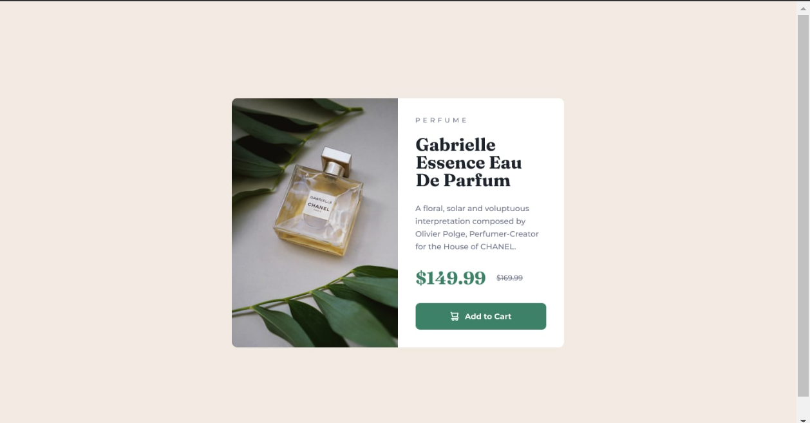

# Projeto card de venda de produto do Frontend Mentor
    Projeto de card de venda de produto do frontend Mentor com intuito de praticar e estudar.

## Imagem do projeto do Frontend Mentor usado como base

### Gif do projeto responsivo

## Tecnologias uilizadas
- HTML
- CSS

## Fonte e tamanho da letra
- Family: [Montserrat](https://fonts.google.com/specimen/Montserrat)
  Weights: 500, 700

- Family: [Fraunces](https://fonts.google.com/specimen/Fraunces)
  Weights: 700
